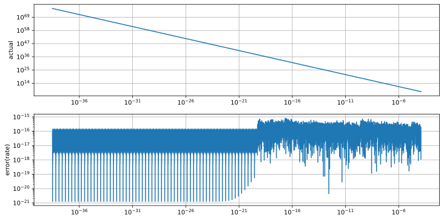

# SaSPoint5DistributionFP64
 SaSPoint5 Distribution Double Precision Implement
 
## SaSPoint5 Distribution
See: [SaSPoint5Distribution](https://github.com/tk-yoshimura/SaSPoint5Distribution)  
Double-Double Precision: [DoubleDoubleStatistic](https://github.com/tk-yoshimura/DoubleDoubleStatistic)  

## Double Precision (IEEE 754) Approx
[C# code](SaSPoint5DistributionFP64/SaSPoint5Distribution.cs)  
[C++ code](SaSPoint5DistributionFP64_CPP/saspoint5_distribution.hpp)  

## Error

### PDF

  
  

### CDF

  

### Complementary CDF

  

### Quantile

  

### Complementary Quantile

  

## Licence
[CC BY 4.0](https://github.com/tk-yoshimura/SaSPoint5DistributionFP64/blob/main/LICENSE)

If anyone would like to use some of the code in this repository, please contact me with an Issue and let me know.  
[Issue](https://github.com/tk-yoshimura/SaSPoint5DistributionFP64/issues)

## Report
[ResearchGate](https://www.researchgate.net/publication/382124528_Numerical_Evaluation_and_High_Precision_Approximation_Formula_for_SaS_point5_Distribution)  
[TechRxiv](https://www.techrxiv.org/users/661998/articles/1156268-numerical-evaluation-and-high-precision-approximation-formula-for-s%CE%B1s-point5-distribution)

## Author

[T.Yoshimura](https://github.com/tk-yoshimura)

## Related Works
[LandauDistributionFP64 &alpha;=1, &beta;=1](https://github.com/tk-yoshimura/LandauDistributionFP64)  
[HoltsmarkDistributionFP64 &alpha;=3/2, &beta;=0](https://github.com/tk-yoshimura/HoltsmarkDistributionFP64)  
[MapAiryDistributionFP64 &alpha;=3/2, &beta;=1](https://github.com/tk-yoshimura/MapAiryDistributionFP64)  
[SaSPoint5DistributionFP64 &alpha;=1/2, &beta;=0](https://github.com/tk-yoshimura/SaSPoint5DistributionFP64)  